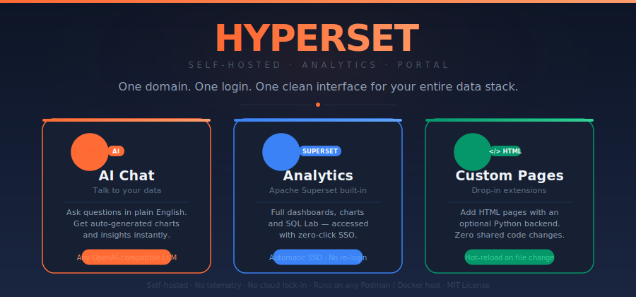
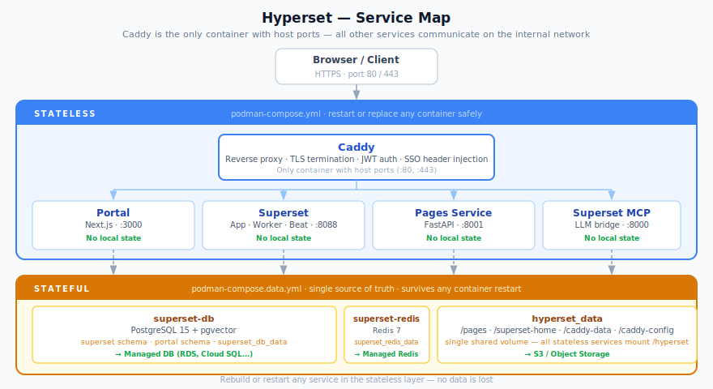
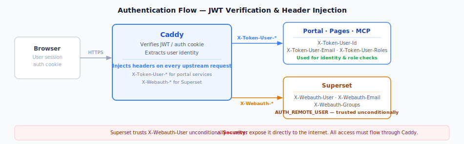

---

## 🚀 Quick Start

### Prerequisites:
- Debian 12+ machine (physical, VM, or LXC)
- Ports 80 and 443 open
- Domain name or local hostname (e.g., `hyperset.internal`)
- OpenAI-compatible LLM API endpoint and key

### 1. Clone and configure:
```bash
git clone https://github.com/CheezeLover/Hyperset.git
cd Hyperset
cp .env.example .env
```

### 2. Edit `.env` - only change these required values:
```bash
# Required: Your domain
HYPERSET_DOMAIN=your-domain.internal

# Required: Generate these with:
#   openssl rand -hex 32  (for keys)
#   openssl rand -base64 42  (for SUPERSET_SECRET_KEY)
AUTH_CRYPTO_KEY=your-32-char-hex-key
SESSION_SECRET=your-32-char-secret
MCP_SERVICE_SECRET=your-32-char-hex-key
SUPERSET_SECRET_KEY=your-42-char-base64-key
```

All other URLs are automatically derived from `HYPERSET_DOMAIN`:
- `https://superset.{HYPERSET_DOMAIN}` - Superset UI
- `https://pages.{HYPERSET_DOMAIN}` - Custom pages
- `https://auth.{HYPERSET_DOMAIN}` - Authentication

### 3. Set up DNS / hosts file:
```
# Add to /etc/hosts or your DNS server
<server-ip>  your-domain.internal
<server-ip>  auth.your-domain.internal
<server-ip>  superset.your-domain.internal
<server-ip>  pages.your-domain.internal
```

### 4. Deploy:
```bash
chmod +x setup_podman.sh
./setup_podman.sh
```

### 5. Create your admin user:
- Wait for initialization to complete (check `podman logs -f hyperset-superset-init`)
- Visit `https://auth.your-domain.internal`
- Register — the first user is automatically granted the `authp/admin` role

### 6. Open the portal:
- Go to `https://your-domain.internal`
- Click **Chat** in the sidebar to talk to your data

### 7. Access Superset:
- Always use `https://superset.your-domain.internal`
- Access through Caddy for automatic SSO login
- **Do NOT** use direct port access - it bypasses authentication



**Important:** Superset is NOT exposed on port 8088 externally. It can only be accessed through Caddy at `https://superset.your-domain.com` with SSO headers.

### Key Architecture Principles

- **Caddy is the ONLY container with host port bindings** (80, 443)
- **Port 8088 is NOT exposed** — all access goes through Caddy with SSO
- **All inter-service traffic stays on the internal network** (hyperset-net)
- **Single PostgreSQL instance:** One PostgreSQL 15 + pgvector container hosts both Superset metadata (the `superset` database) and all portal data (the `portal` schema). The portal role has limited privileges — it only owns its own schema.
- **Security:** Header-based authentication with zero trust for direct Superset access
- **Two-file compose split:** `podman-compose.data.yml` holds all stateful services; `podman-compose.yml` holds all stateless services that can be freely restarted or scaled

### Volume Layout

| Volume | File | Purpose | Cloud equivalent |
|--------|------|---------|-----------------|
| `superset_db_data` | `data.yml` | PostgreSQL 15 — Superset metadata **and** portal schema (admin settings, pages, knowledge base) | Managed DB (RDS, Cloud SQL…) |
| `superset_redis_data` | `data.yml` | Redis snapshots / AOF | Managed Redis (ElastiCache…) |
| `hyperset_data` | `data.yml` | All file-based state (see below) | Object storage (S3, Blob…) |

`hyperset_data` is a single volume shared by all stateless services, using subfolders:

```
/hyperset/
├── pages/          ← static page content (portal + pages service)
├── superset-home/  ← Superset home dir, Celery beat schedule
├── caddy-data/     ← TLS certificates (XDG_DATA_HOME)
└── caddy-config/   ← Caddy config cache (XDG_CONFIG_HOME)
```

### Authentication Flow



**Critical security rule:** Superset must **not** be directly internet-accessible. Only Caddy should reach it — it trusts the `X-Webauth-User` header unconditionally.

### Header Injection

Caddy injects these headers into all upstream requests (signed JWT, verified by Caddy):

| Header | Content |
|--------|---------|
| `X-Token-User-Id` | User identifier |
| `X-Token-User-Email` | User email |
| `X-Token-User-Roles` | Space-separated role list |
| `X-Webauth-User` | Username forwarded to Superset |
| `X-Webauth-Email` | Email forwarded to Superset |
| `X-Webauth-Groups` | Roles forwarded to Superset |

Required Superset configuration:
```python
AUTH_TYPE = AUTH_REMOTE_USER
REMOTE_USER_ENV_VAR = "HTTP_X_WEBAUTH_USER"
```

---

## ⚙️ Environment Variables

All variables live in the root `.env` file and are shared across containers via `podman-compose`. Variables marked **required** have no safe default and must be set before starting.

### Core / Infrastructure

| Variable | Required | Default | Description |
|----------|----------|---------|-------------|
| `HYPERSET_DOMAIN` | ✅ | — | Base domain (e.g., `hyperset.internal`). All subdomains are derived from this. |
| `AUTH_CRYPTO_KEY` | ✅ | — | 32-byte hex key for JWT signing and auth cookie encryption. Generate: `openssl rand -hex 32` |
| `SESSION_SECRET` | ✅ | — | Min-32-char secret for iron-session cookie encryption (admin settings). Generate: `openssl rand -base64 32` |
| `MCP_SERVICE_SECRET` | ✅ | — | Min-32-char HMAC secret shared between the portal and the MCP server for token signing. Generate: `openssl rand -hex 32` |

### Database

| Variable | Required | Default | Description |
|----------|----------|---------|-------------|
| `DATABASE_PASSWORD` | ✅ | — | Password for the `superset` PostgreSQL superuser. Also used internally to provision the portal role. Generate: `openssl rand -hex 32` |
| `PORTAL_DATABASE_PASSWORD` | ✅ | — | Password for the `portal` PostgreSQL role (limited privileges, owns only the `portal` schema). Generate: `openssl rand -hex 32` |
| `SUPERSET_ADMIN_PASSWORD` | ✅ | — | Password for the Superset `admin` web UI account created by `superset-init`. |

> **Self-provisioning:** On first boot the portal app automatically creates the `vector` extension, the `portal` role, and the `portal` schema inside the shared PostgreSQL instance using the `superset` superuser credentials (`PORTAL_SETUP_DATABASE_URL` is derived from `DATABASE_PASSWORD` automatically in the compose file). On cloud providers where this provisioning is done externally (RDS, Cloud SQL, Supabase…) simply leave `PORTAL_SETUP_DATABASE_URL` unset — the portal will skip setup and connect directly with `PORTAL_DATABASE_URL`.

### Superset Integration

| Variable | Required | Default | Description |
|----------|----------|---------|-------------|
| `SUPERSET_SECRET_KEY` | ✅ | — | 42-byte base64 secret for Superset session encryption. Generate: `openssl rand -base64 42` |
| `SUPERSET_UPSTREAM` | — | `http://hyperset-superset:8088` | Internal address (auto-configured) |
| `SUPERSET_PUBLIC_URL` | — | `https://superset.{HYPERSET_DOMAIN}` | Browser URL (auto-derived) |
| `SUPERSET_MCP_USER` | — | `admin` | Superset username for MCP calls. In `AUTH_REMOTE_USER` mode no password is needed. |
| `SUPERSET_MCP_PASSWORD` | — | _(empty)_ | Superset password. Only required for classic DB auth. |

### LLM / Chat

| Variable | Required | Default | Description |
|----------|----------|---------|-------------|
| `LLM_API_URL` | ✅ | — | OpenAI-compatible API base URL (e.g., `https://api.mistral.ai/v1`, `http://localhost:11434/v1`). |
| `LLM_API_KEY` | ✅ | — | API key for the LLM provider. |
| `LLM_MODEL` | — | `gpt-4o` | Default model name passed to the API. |
| `LLM_SYSTEM_PROMPT` | — | _(built-in)_ | Override the default system prompt for the AI chat assistant. If unset, the built-in Hyperset prompt is used. |
| `LLM_MAX_TURNS` | — | `40` | Maximum agentic turns (tool call round-trips) per chat message. Range: 1–200. |
| `LLM_MAX_TOOL_RESULT_CHARS` | — | `3000` | Maximum characters returned per tool call result. Reduce for low-context models. Range: 500–50000. |
| `LLM_MAX_HISTORY_MESSAGES` | — | `20` | Maximum conversation history messages sent to the LLM. Range: 4–200. |

> **Note:** All LLM settings can be overridden at runtime by admins via the settings gear icon in the chat. Runtime overrides take priority over environment variables.

### Pages Service

| Variable | Required | Default | Description |
|----------|----------|---------|-------------|
| `PAGES_PUBLIC_URL` | — | `https://pages.{HYPERSET_DOMAIN}` | Browser URL (auto-derived from HYPERSET_DOMAIN) |
| `HYPERSET_PORTAL_URL` | — | `https://{HYPERSET_DOMAIN}` | Portal URL (auto-derived) |

### AI Chart Cleanup

| Variable | Required | Default | Description |
|----------|----------|---------|-------------|
| `HYPERSET_CLEANUP_DELAY_MINUTES` | — | `120` | How long (in minutes) to keep AI-generated temporary charts before automatic deletion. Range: 1–10080 (1 min to 1 week). Can also be set at runtime via the admin panel. |

### OAuth / OIDC (only needed with an external identity provider)

| Variable | Required | Default | Description |
|----------|----------|---------|-------------|
| `OAUTH_CLIENT_ID` | — | — | OAuth 2.0 client ID from your identity provider. |
| `OAUTH_CLIENT_SECRET` | — | — | OAuth 2.0 client secret. |
| `OIDC_METADATA_URL` | — | — | OIDC discovery endpoint (e.g., `https://login.microsoftonline.com/{tenant}/v2.0/.well-known/openid-configuration`). |
| `ENTRA_TENANT_ID` | — | `common` | Azure AD / Entra tenant ID. Set to a specific tenant GUID for single-tenant deployments. |

### MCP Server (advanced, Superset-MCP only)

These are only needed if you run the MCP server outside of podman-compose or need to change its defaults.

| Variable | Required | Default | Description |
|----------|----------|---------|-------------|
| `SUPERSET_MCP_URL` | — | `http://hyperset-superset-mcp:8000/mcp` | Full URL of the MCP server as seen by the portal. Override in local dev (e.g., `http://localhost:8000/mcp`). |
| `HYPERSET_PORTAL_URL` | — | `https://pages.{HYPERSET_DOMAIN}` | URL the MCP server uses to fetch runtime admin settings (cleanup delay). Override in local dev (e.g., `http://localhost:3000`). |
| `HYPERSET_CLEANUP_USER` | — | `admin@HYPERSET.local` | Superset username the cleanup job impersonates when deleting stale AI charts. Must be a valid Superset admin. |
| `HYPERSET_CLEANUP_EMAIL` | — | `admin@HYPERSET.local` | Superset email for the cleanup job identity. |
| `MCP_TRANSPORT` | — | `streamable-http` | MCP transport mode. Use `stdio` for Claude Desktop integration. |
| `MCP_HOST` | — | `0.0.0.0` | Bind address for the MCP HTTP server. |
| `MCP_PORT` | — | `8000` | Bind port for the MCP HTTP server. |

### Portal Internal (advanced)

| Variable | Required | Default | Description |
|----------|----------|---------|-------------|
| `PORTAL_DATABASE_URL` | — | _(derived from compose)_ | Full connection string for the portal role: `postgresql://portal:<PORTAL_DATABASE_PASSWORD>@hyperset-superset-db:5432/superset`. Set explicitly for cloud deployments. |
| `PORTAL_SETUP_DATABASE_URL` | — | _(derived from compose)_ | Admin connection string used **once on first boot** to provision the pgvector extension, `portal` role, and `portal` schema. Omit when provisioning is done externally (RDS, Cloud SQL, Supabase). |

---

## 🤖 AI Chart Cleanup

When the AI chat creates charts, they are stamped with `[HYPERSET-AI-TEMPORARY]` and a UTC timestamp in their description. A background job in the MCP server automatically deletes these after the configured delay.

**Lifecycle of an AI chart:**
1. **Created** → stamped `[HYPERSET-AI-TEMPORARY] {ISO-datetime} | {user}`
2. **Added to a dashboard** → automatically promoted to `[HYPERSET-AI-PERMANENT]` (never deleted)
3. **"Keep permanently" clicked** → promoted to `[HYPERSET-AI-PERMANENT]` (never deleted)
4. **Ignored past the delay** → deleted by the cleanup job

**Cleanup job behavior:**
- Runs every 5 minutes
- Fetches the current delay from the portal's `/api/cleanup-config` endpoint (so admin-panel changes take effect without restarting)
- Falls back to `HYPERSET_CLEANUP_DELAY_MINUTES` env var if the portal is unreachable
- Logs all deletions at INFO level

**Configure via admin panel:** The gear icon in chat → "Temporary chart lifetime" field (in minutes).

---

## 🛠️ Maintenance & Updates

### Updating Components

**Portal:**
```bash
podman rm -f hyperset-portal
podman-compose up --build -d portal
```

**MCP Server:**
```bash
podman rm -f hyperset-superset-mcp
podman-compose up --build -d superset-mcp
```

**Superset:**
```bash
podman rm -f hyperset-superset hyperset-superset-worker hyperset-superset-beat
podman-compose -f podman-compose.data.yml -f podman-compose.yml up --build -d superset-app superset-worker superset-beat
```

### Backup & Restore

**Superset Database:**
```bash
# Backup
podman exec hyperset-superset-db pg_dump -U superset superset > superset_backup.sql

# Restore
cat superset_backup.sql | podman exec -i hyperset-superset-db psql -U superset superset
```

**Portal Data (portal schema inside superset-db):**
```bash
# Backup — dumps only the portal schema
podman exec hyperset-superset-db pg_dump -U superset -n portal superset > portal_backup.sql

# Restore
cat portal_backup.sql | podman exec -i hyperset-superset-db psql -U superset superset
```

**File State (pages, TLS certs, Superset home):**
```bash
# Backup the entire hyperset_data volume
podman run --rm -v hyperset_data:/hyperset -v $(pwd):/backup \
  busybox tar czf /backup/hyperset_data_backup.tar.gz -C /hyperset .

# Restore
podman run --rm -v hyperset_data:/hyperset -v $(pwd):/backup \
  busybox tar xzf /backup/hyperset_data_backup.tar.gz -C /hyperset
```

**Caddy Users:**
```bash
# Backup
cp Caddy/users.json users_backup.json

# Restore
cp users_backup.json Caddy/users.json
podman-compose -f podman-compose.data.yml -f podman-compose.yml restart caddy
```

---

## 🚨 Troubleshooting

### Common Issues

**🔴 Chat not responding / API key error**
- Verify `LLM_API_KEY` and `LLM_API_URL` in `.env`
- Test connectivity: `curl $LLM_API_URL/models -H "Authorization: Bearer $LLM_API_KEY"`
- Check portal logs: `podman logs hyperset-portal -f`

**🔴 MCP connection errors / data tools disabled**
- Verify `MCP_SERVICE_SECRET` is the same in both `.env` and `Superset-MCP/.env`
- Check MCP logs: `podman logs hyperset-superset-mcp -f`
- Verify `SUPERSET_UPSTREAM` is reachable from the `hyperset-net` network
- Test: `curl http://localhost:8000/mcp`

**🔴 AI chart cleanup failing (400 errors)**
- Check MCP logs for `chart list query failed`
- Verify `HYPERSET_CLEANUP_USER` / `HYPERSET_CLEANUP_EMAIL` match a valid Superset admin account

**🔴 Embedded charts showing wrong domain / broken iframes**
- Verify `SUPERSET_PUBLIC_URL` is set to the browser-accessible Superset URL
- This must not be an internal hostname (e.g., `http://hyperset-superset:8088`) — it must resolve in the user's browser

**🔴 Login loop / auth issues**
- Verify `AUTH_CRYPTO_KEY` is set and is a 32-byte hex string
- Verify `auth.{HYPERSET_DOMAIN}` resolves correctly
- Test Superset header auth: `curl -H "X-Webauth-User: admin@HYPERSET.local" http://localhost:8088/api/v1/me/`

**🔴 Superset asking for login instead of using SSO (integrated mode)**
- Ensure you're accessing Superset through Caddy: `https://superset.{HYPERSET_DOMAIN}`
- **Do NOT access Superset directly** via `http://your-server:8088` - this bypasses authentication!
- Port 8088 is intentionally NOT exposed
- All Superset access must go through Caddy for SSO headers to be injected
- Verify Caddy is forwarding headers in the Caddyfile:
  ```
  header_up X-Webauth-User  {http.request.header.X-Token-User-Email}
  header_up X-Webauth-Email {http.request.header.X-Token-User-Email}
  header_up X-Webauth-Groups {http.request.header.X-Token-User-Roles}
  ```
- Check Caddy logs: `podman logs hyperset-caddy -f`

**🔴 Pages not appearing**
- Verify `pages.{HYPERSET_DOMAIN}` resolves correctly
- Check Pages service logs: `podman logs hyperset-pages -f`
- List discovered pages: `curl https://pages.{HYPERSET_DOMAIN}/__pages__`

### Service Health Checks

```bash
# Portal
curl -I http://localhost:3000/api/config

# MCP Server
curl -I http://localhost:8000/mcp

# Superset
curl -I http://localhost:8088/health
```

### View Logs

```bash
# All services (follow)
podman-compose logs -f

# Specific service
podman logs hyperset-portal -f
podman logs hyperset-superset-mcp -f
podman logs hyperset-caddy -f
```

---

## 📚 API Reference

### Portal API

| Method | Endpoint | Description |
|--------|----------|-------------|
| `GET` | `/api/config` | Public config: Superset URL, Pages URL, current user |
| `GET` | `/api/chat` | Health check / MCP connectivity probe |
| `POST` | `/api/chat` | Streaming chat completion |
| `GET` | `/api/admin` | Get current effective LLM settings (admin only) |
| `POST` | `/api/admin` | Save runtime LLM settings (admin only) |
| `DELETE` | `/api/admin` | Reset runtime settings to env defaults (admin only) |
| `PATCH` | `/api/admin` | Validate API credentials (admin only) |
| `GET` | `/api/cleanup-config` | Get current cleanup delay in minutes (used by MCP server) |
| `POST` | `/api/chart-promote` | Promote an AI chart from temporary to permanent |

### Pages Service

| Method | Endpoint | Description |
|--------|----------|-------------|
| `GET` | `/__pages__` | List all discovered pages |
| `GET` | `/{page_name}` | Serve a custom page |
| `*` | `/{page_name}/api/*` | Proxy to the page's backend |

### MCP Server

| Method | Endpoint | Description |
|--------|----------|-------------|
| `POST` | `/mcp` | MCP protocol endpoint (requires `Authorization: Bearer <token>`) |

---

## 🎯 Project Philosophy

**Self-hosted first:** No cloud lock-in, no telemetry, no external dependencies

**Container-native:** Everything runs in Podman/Docker with minimal host requirements

**Extensible:** Add features without modifying shared code (drop-in pages, custom backends)

**Secure by default:** Header-based auth, internal networking, TLS everywhere

**Developer-friendly:** Hot-reload for pages, clear logs, TypeScript throughout

---

## 🙏 Acknowledgments

Hyperset builds upon the excellent work of the open-source community:

### Core Dependencies

- **[Apache Superset](https://superset.apache.org/)** - The powerful analytics and visualization platform that makes data exploration possible. Thank you to the Apache Software Foundation and all Superset contributors.

- **[Caddy Web Server](https://caddyserver.com/)** - The amazing automatic HTTPS server that handles all our reverse proxy, authentication, and security needs. Special thanks to Matt Holt and the Caddy team, plus Paul Greenberg (Greenpau) for the caddy-security plugin.

- **[Next.js](https://nextjs.org/)** - The React framework that powers our portal. Thank you to Vercel for creating such a productive developer experience.

### Modified Components

- **Superset MCP Server** - Originally created by [Aptro](https://github.com/aptro) and licensed under MIT. We forked and significantly enhanced it with:
  - Header-based SSO authentication (no credentials needed)
  - HMAC-signed tokens for secure portal communication
  - AI chart provenance and automatic cleanup system
  - Full Hyperset integration

### Infrastructure

- **[PostgreSQL](https://www.postgresql.org/)** - The world's most advanced open-source relational database
- **[Redis](https://redis.io/)** - The blazing-fast in-memory data store for caching and task queues
- **[Podman](https://podman.io/)** - Rootless container management without daemon bloat

### Special Thanks

To all the maintainers, contributors, and communities behind these projects. Hyperset wouldn't exist without your dedication to open-source software.

---

## 📄 License

MIT License - See [LICENSE](LICENSE) file for details.

This project includes third-party components with their own licenses:
- Superset-MCP: MIT License (Copyright 2025 Aptro) - See [Superset-MCP/LICENSE](Superset-MCP/LICENSE)
- Apache Superset: Apache License 2.0
- Caddy: Apache License 2.0
- Next.js: MIT License
- PostgreSQL: PostgreSQL License
- Redis: BSD 3-Clause License

See [NOTICE](NOTICE) file for full attribution details.

---

*Built with ❤️ for data teams who value privacy and control*
